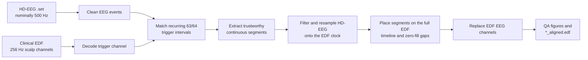

# Stanford Sleep-Lab EEG Alignment

This MATLAB pipeline aligns a Stanford high-density EEG recording with its
clinical sleep-study EDF. The two acquisition systems share an all-night trigger
sequence, but they have independent start times and clocks. The pipeline uses
the shared trigger intervals to identify trustworthy continuous regions, maps
the high-density EEG onto the **clinical EDF clock**, and writes a new EDF in
which the clinical EEG channels contain the aligned high-density signals.

[`align_recordings.m`](align_recordings.m) is the entry point. It preserves the
clinical EDF as the output container: non-EEG signals remain unchanged, matched
high-density EEG regions are resampled onto the EDF sample grid, and time ranges
that cannot be aligned safely are filled with zeros.

## Why alignment is needed

The HD-EEG and clinical systems record the same night independently. Even when
both receive the same triggers, they may begin at different times, accumulate
small clock drift, or lose individual triggers. Matching by recording start time
alone would therefore introduce offsets that grow over the night.

The Stanford trigger schedule provides repeated landmarks. Four consecutive
`64` triggers delimit a recurring cycle; the intervening `63` triggers carry a
distinctive interval pattern. The pipeline compares that pattern between the
two systems, excludes unsafe gaps, and estimates the HD-EEG sampling rate
separately within each continuous matched segment.



## Pipeline at a glance

The ten rows below correspond to the progress checklist printed by
`align_recordings.m`.

| Step | Stage | Main code | Result |
| ---: | --- | --- | --- |
| 1 | Load the EDF trigger channel | `SleepEEG_loadedf` | Trigger trace and trigger-channel sampling rate |
| 2 | Load the HD-EEG recording | `ANT_interface_loadset` | EEGLAB `EEG` structure at 500 Hz |
| 3 | Load the clinical EDF | `SleepEEG_loadedf` | Complete EDF and 256 Hz scalp-channel clock |
| 4 | Extract and match triggers | `extract_triggers`, `match_triggers`, `extract_segments` | Table of trustworthy continuous segments |
| 5 | Truncate HD-EEG channels | `truncate_eeg_segments` | One channels-by-samples array per segment |
| 6 | Resample the segments | `resample_eeg_segments` | Filtered HD-EEG on the exact EDF sample grid |
| 7 | Rebuild the full timeline | `concatenate_eeg_segments` | EDF-length array with zeros outside matched regions |
| 8 | Substitute EDF EEG signals | `substitute_eeg_data` | Updated EDF signal cell with direct and referenced EEG channels |
| 9 | Run final sanity checks | `sanity_check_spectrogram`, `sanity_check_EOG` | Spectrogram and EOG comparison figures |
| 10 | Write the aligned EDF | `blockEdfWrite` | `<clinical-name>_aligned.edf` |

## Requirements

- MATLAB R2025b, the release used to validate the current test suite. Earlier
  releases have not been tested for this repository.
- Signal Processing Toolbox (`buttord`, `butter`, `zp2sos`, `filtfilt`,
  `kaiserord`, `kaiser`, `pwelch`, and `dpss`).
- Statistics and Machine Learning Toolbox, used by the spectrogram QA scaling
  helper.
- The lab's `sleepeeg_code` repository, which supplies `SleepEEG_loadedf`,
  `blockEdfWrite`, `multitaper_spectrogram_mex` and its compiled backend, and
  `climscale`.
- The lab's `ant_interface_code` repository, which supplies
  `ANT_interface_loadset` and access to EEGLAB.

The current entry point adds these lab repositories from paths under
`~/Dropbox/Active_projects/EEG/code/`. Update those `addpath` calls if your
checkout is elsewhere.

<details>
<summary><strong>Current input and recording assumptions</strong></summary>

The implementation intentionally fails early when the Stanford acquisition
contract is not met:

- The HD-EEG `.set` file has a sampling rate of exactly 500 Hz.
- The clinical EDF contains a channel labeled exactly `C3`, sampled at exactly
  256 Hz.
- The EDF trigger channel is currently hard-coded to `TcPPG`.
- The first non-impedance, non-boundary HD-EEG events are the validation
  sequence `1, 2, 4, 8, 16, 32, 64`.
- At least one `1, 2, 4, 8, 16, 32, 64` validation sequence is also present in
  the decoded EDF triggers.
- After validation events are removed, alignment triggers are only `63` and
  `64`, and `64` occurs in runs of exactly four.
- The EDF and HD-EEG contain compatible repeated canonical cycles of exactly
  50 triggers.
- The EDF scalp sampling rate is an integer multiple of the EDF trigger-channel
  sampling rate.
- HD-EEG labels match the Stanford mapping in step 5. The EDF contains exactly
  one of every direct and referenced replacement label in step 8, plus the
  `E2:M1`, `E1:M2`, and `E2:M2` channels required by the final EOG check.

These are executable assertions, not general EDF requirements. A recording
with different sampling rates, trigger-value ranges, trigger codes, or channel
labels requires a deliberate code update and corresponding tests.

</details>

## Expected data layout

Run the pipeline from the repository root. The current path construction expects
the following subject-level layout:

```text
sleeplab_trigger_alignment/
├── align_recordings.m
├── helper_functions/
├── tests/
└── <subject_code>/
    ├── set/
    │   └── <subject_code>_sleep_ds500_Z3.set
    └── clinical/
        └── <clinical recording>.edf
```

The only subject-data directory currently ignored is `sas_023/`. Add an ignore
rule for any new subject directory **before** placing recording data inside the
repository; subject data should not be committed.

## Running the pipeline

1. Open [`align_recordings.m`](align_recordings.m).
2. Update the subject code, trigger-channel label, clinical EDF filename, and
   external `addpath` locations near the top of the file.
3. In MATLAB, change into the repository root and run:

```matlab
cd('/path/to/sleeplab_trigger_alignment')
align_recordings
```

The function prints a ten-step progress checklist, opens diagnostic figures,
and writes the aligned EDF beside the source clinical EDF.

> **Current interface note:** the values of `subject_code` and `trig_channel`
> passed as function arguments are presently overwritten by the defaults near
> the top of `align_recordings.m`. Edit those defaults before running; do not
> rely on `align_recordings(subject_code, trig_channel)` to select a subject yet.

## Pipeline, step by step

### 1. Load the EDF trigger channel

The pipeline first loads only the selected trigger channel from the clinical
EDF. This is the low-memory pass used to recover the trigger waveform and its
sampling rate.

<details>
<summary><strong>Technical details</strong></summary>

`SleepEEG_loadedf(fn_edf, {trig_channel})` returns the EDF header, the selected
signal header, and its samples. The trigger sampling rate is derived from EDF
metadata rather than hard-coded:

```matlab
trigger_Fs = signalHeader.samples_in_record ./ header.data_record_duration;
```

The selected trace is later stored as `edf_input.DC_trace`; its sample indices
remain on the **EDF trigger-channel clock**, which can differ from the EDF scalp
clock.

</details>

### 2. Load the HD-EEG recording

The Stanford HD-EEG `.set` file is loaded into an EEGLAB `EEG` structure. Its
events provide one side of the shared trigger sequence, while `EEG.data`
provides the channels that will ultimately be aligned.

<details>
<summary><strong>Technical details</strong></summary>

The path is split with `fileparts`, then loaded with
`ANT_interface_loadset(filename, filepath, false)`. That wrapper starts EEGLAB
without its GUI and calls `pop_loadset`. The pipeline reads `EEG.srate` and
asserts that it is exactly 500 Hz.

The HD-EEG clock is not assumed to remain exactly 500 Hz during alignment. The
nominal rate is used for trigger times and input validation; a segment-specific
effective rate is derived later from matched EDF anchors.

</details>

### 3. Load the complete clinical EDF

The pipeline then loads every clinical EDF channel. The original EDF supplies
the authoritative output duration, channel headers, non-EEG signals, and the
256 Hz scalp-channel sample grid.

<details>
<summary><strong>Technical details</strong></summary>

The scalp sampling rate is derived from the exact `C3` label:

```matlab
c3_index = strcmp({signalHeader_all.signal_labels}, 'C3');
edf_Fs = signalHeader_all(c3_index).samples_in_record ...
    / header_all.data_record_duration;
```

The implementation asserts `edf_Fs == 256`. The number of samples in this C3
signal later defines the total length of the aligned EEG matrix.

</details>

### 4. Extract triggers, match cycles, and define continuous segments

Both recordings are reduced to cleaned trigger tables. The pipeline learns the
recurring nightly interval pattern, matches corresponding chunks across the two
systems, and converts only trustworthy runs of paired intervals into continuous
segments. Unsafe gaps split segments rather than being interpolated across.

<details>
<summary><strong>Technical details: trigger extraction</strong></summary>

[`extract_triggers.m`](helper_functions/extract_triggers.m) performs different
cleanup for each acquisition system.

For HD-EEG events it:

- normalizes event types to stripped strings;
- removes impedance events and EEGLAB `boundary` events;
- verifies and removes the initial `1, 2, 4, 8, 16, 32, 64` validation sequence;
- requires all remaining events to be `63` or `64`; and
- requires each retained run of `64` events to contain exactly four triggers.

For the EDF trigger waveform it finds contiguous samples above the numeric
threshold `1` and maps each chunk's maximum loaded value to a trigger code. The
thresholds are interpreted in the channel's physical units as returned by the
EDF loader:

| Trigger code | Accepted peak range |
| ---: | ---: |
| `1` | 5–6 |
| `2` | 11–12 |
| `4` | 18–19 |
| `8` | 24–25 |
| `16` | 30–31 |
| `63` | 36–37 |
| `64` | 42–43 |

Stable 63-to-64 transitions that arrived as one above-threshold chunk are split
before classification when both value-range runs contain at least three samples.
The extractor also resolves the validation sequence's ambiguous sixth pulse as
`32`, removes unmapped orphan chunks, removes all validation occurrences, and
discards malformed `64` runs.

Trigger times in both systems use MATLAB's one-based sample convention:

```text
time_seconds = (latency - 1) / sampling_rate
```

Because the entry point passes `true`, a three-panel comparison of HD-EEG,
clinical EDF, and overlaid inter-trigger intervals is plotted.

</details>

<details>
<summary><strong>Technical details: trigger matching</strong></summary>

[`match_triggers.m`](helper_functions/match_triggers.m) calls
[`extract_canonical_cycle.m`](helper_functions/extract_canonical_cycle.m) for
each system. Runs of four `64` events define candidate cycle boundaries. Among
bounded chunks, the most frequently repeated trigger-type and interval
structure becomes the canonical cycle. The first retained events must begin at
a four-`64` boundary, at least three intact boundaries must be present, the
selected structure must repeat at least twice, and ties between distinct
structures are rejected.

The EEG and EDF canonical cycles must each contain exactly 50 triggers with the
same types and interval timing within a shared tolerance:

```matlab
interval_tolerance_sec = 2 / min([eeg_Fs, edf_trigger_Fs]);
```

The matcher advances through EEG and EDF chunks independently. It explicitly
records canonical matches, short loss in either system, a shared trigger glitch,
a suspected missing cycle boundary, divergent noncanonical chunks, leading EDF
data before a trigger-box restart, and the terminal relationship between the
recordings. Supported gaps are bracketed by trustworthy trigger anchors;
ambiguous loss that cannot be resolved safely stops or requires re-locking.

With plotting enabled, the matcher shows the original HD-EEG trigger timeline,
the HD-EEG timeline shifted to the initial EDF anchor, and the EDF timeline.
Unsafe intervals and terminal padding/truncation are marked on the plot.

</details>

<details>
<summary><strong>Technical details: continuous-segment extraction and drift checks</strong></summary>

[`extract_segments.m`](helper_functions/extract_segments.m) reconstructs the
matched trigger intervals from the matcher's comparison history. Consecutive
paired intervals become one segment; discontinuities in either system begin a
new segment. The resulting table includes inclusive EEG and EDF start/end
samples, durations, source chunk/interval identifiers, and clock-drift metrics.

For every segment, cumulative

```text
EDF elapsed time - HD-EEG elapsed time
```

is fit as a linear function of HD-EEG elapsed time. The maximum detrended
residual must remain within the trigger-matching tolerance. This guards the
later constant-rate resampling step against nonlinear clock behavior inside a
segment. The table is printed, and the current entry point also plots the drift
series because it passes `true`.

</details>

### 5. Truncate and order the HD-EEG channels

For each matched segment, the required Stanford channels are selected from the
full HD-EEG recording in a fixed clinical order. The auxiliary vertical EOG
channel follows the same alignment path for QA but is not substituted into the
EDF.

<details>
<summary><strong>Technical details: channel mapping</strong></summary>

[`truncate_eeg_segments.m`](helper_functions/truncate_eeg_segments.m) uses the
following exact label mapping:

| Aligned label | Stanford HD-EEG label | Role |
| --- | --- | --- |
| `Fp1` | `L1` | EDF EEG |
| `Fp2` | `R1` | EDF EEG |
| `F3` | `LL2` | EDF EEG |
| `F4` | `RR2` | EDF EEG |
| `C3` | `LA2` | EDF EEG |
| `C4` | `RA2` | EDF EEG |
| `O1` | `LL11` | EDF EEG |
| `O2` | `RR11` | EDF EEG |
| `M1` | `LD6` | EDF mastoid |
| `M2` | `RD6` | EDF mastoid |
| `VEOGL` | `VEOGL` | QA only |

The helper returns one cell per matched segment, with channels in rows and the
inclusive range `eeg_start_sample:eeg_end_sample` in columns. Missing mapped
labels cause an error rather than a positional fallback.

</details>

### 6. Filter and resample each segment onto the EDF clock

Each continuous HD-EEG segment is mean-centered, high-pass filtered, protected
against aliasing, and evaluated directly on the exact 256 Hz EDF sample grid.
The EDF duration between matched trigger anchors—not the nominal 500 Hz clock—
determines the resampling ratio.

<details>
<summary><strong>Technical details: timing and exact output length</strong></summary>

For each segment, the effective HD-EEG rate is

```text
edf_duration_sec   = (edf_end - edf_start) / edf_trigger_Fs
effective_eeg_Fs   = (eeg_end - eeg_start) / edf_duration_sec
target_sample_span = (edf_end - edf_start) * (edf_Fs / edf_trigger_Fs)
output_count       = round(target_sample_span) + 1
```

The `+1` preserves both inclusive anchor samples. Zero-based output position
`k = 0, ..., target_sample_span` maps to

```text
k * eeg_sample_span / target_sample_span
```

on the input segment, so the first and last samples land exactly on their
matched EDF anchors. The helper asserts the target span is integral and verifies
the output length for every segment.

</details>

<details>
<summary><strong>Technical details: filtering and interpolation</strong></summary>

[`resample_eeg_segments.m`](helper_functions/resample_eeg_segments.m) applies
the following operations to every channel:

1. Convert to double precision.
2. Subtract the channel mean.
3. Apply a zero-phase Butterworth high-pass using second-order sections and
   `filtfilt`: 80 dB final attenuation at 0.15 Hz and no more than 0.05 dB final
   loss at the 0.30 Hz passband edge.
4. Evaluate a Kaiser-windowed sinc kernel on the EDF grid. The same kernel
   combines fractional-delay interpolation with an 80 dB anti-aliasing design
   whose passband ends at 120 Hz and stopband begins at the 128 Hz EDF Nyquist
   frequency.

The sinc calculation is blockwise to avoid creating an hours-long dense weight
matrix, and it reflects sample indices at segment boundaries. Near 500 Hz, the
anti-aliasing design produces a 315-tap symmetric kernel. Very-low-frequency
high-pass transients can extend roughly 50–60 seconds from a segment edge, which
is important when interpreting short segments.

Because the entry point enables sanity plots, each segment also produces a
5-by-2 trace comparison for the ten EDF EEG/mastoid channels: the
mean-centered, high-pass, anti-alias-filtered signal on the input grid versus
the resampled signal on the EDF output grid. A second figure shows a Welch
spectrum of the resampled signals. `VEOGL` is excluded from these plots.

</details>

### 7. Concatenate segments and zero-fill the EDF timeline

The resampled segments are placed at their matching positions on an array with
the exact length of the original EDF C3 channel. Samples before the first
segment, between segments, and after the last segment remain zero.

<details>
<summary><strong>Technical details</strong></summary>

Matched EDF bounds are still expressed on the trigger-channel clock. With

```text
ratio = edf_Fs / edf_trigger_Fs
```

[`concatenate_eeg_segments.m`](helper_functions/concatenate_eeg_segments.m)
converts either inclusive one-based bound as

```text
scalp_sample = (trigger_sample - 1) * ratio + 1
```

The helper requires an integer ratio, chronological non-overlapping segments,
in-range bounds, and an exact agreement between each resampled segment's length
and its converted EDF bounds. It preallocates zeros, so unmatched or unsafe
regions are explicit in every aligned channel, including `VEOGL`.

</details>

### 8. Substitute direct and referenced EEG channels into the EDF

The aligned high-density signals replace both the direct clinical EEG/mastoid
channels and the standard contralaterally referenced clinical derivations. All
non-target EDF channels remain as loaded from the source file.

<details>
<summary><strong>Technical details: substituted signals</strong></summary>

[`substitute_eeg_data.m`](helper_functions/substitute_eeg_data.m) first replaces
the ten direct channels by exact label: `Fp1`, `Fp2`, `F3`, `F4`, `C3`, `C4`,
`O1`, `O2`, `M1`, and `M2`.

It then constructs and replaces eight referenced channels:

| EDF signal | Aligned calculation |
| --- | --- |
| `Fp1:M2` | `Fp1 - M2` |
| `Fp2:M1` | `Fp2 - M1` |
| `F3:M2` | `F3 - M2` |
| `F4:M1` | `F4 - M1` |
| `C3:M2` | `C3 - M2` |
| `C4:M1` | `C4 - M1` |
| `O1:M2` | `O1 - M2` |
| `O2:M1` | `O2 - M1` |

Every source and destination is resolved by name, and duplicate, missing, or
wrong-length channels cause an error. `VEOGL` stays in the aligned working array
for the EOG check but is not written over a clinical EDF signal.

The original EDF signal headers are retained. `blockEdfWrite` therefore maps
the replacement physical values through each destination channel's existing
physical/digital limits when writing the final int16 samples.

</details>

### 9. Run final sanity checks

Two final views compare the aligned output with signals that remain in their
native recording context: a C3:M2 spectrogram comparison and a four-trace EOG
comparison. These are intended for human review before the aligned EDF is used
downstream.

<details>
<summary><strong>Technical details: QA figures</strong></summary>

[`sanity_check_spectrogram.m`](helper_functions/sanity_check_spectrogram.m)
compares:

- native HD-EEG `C3:M2`, calculated as `LA2 - RD6` after mean-centering and the
  same high-pass filter, at the original 500 Hz; and
- the substituted EDF `C3:M2`, already resampled and zero-padded, at the EDF
  rate.

Both use multitaper spectrograms over 0–40 Hz with shared color limits.

[`sanity_check_EOG.m`](helper_functions/sanity_check_EOG.m) compares aligned
`VEOGL:M2` (`VEOGL - RD6`) with the unchanged clinical signals `E2:M1`, `E1:M2`,
and `E2:M2` on a shared EDF time axis.

Together with the optional plots enabled in steps 4 and 6, the current entry
point opens:

- inter-trigger interval comparisons;
- the original/aligned/EDF trigger timeline;
- a clock-drift plot with one trace per segment;
- per-segment time-trace and Welch-spectrum resampling checks;
- native-versus-aligned C3:M2 spectrograms; and
- aligned-versus-clinical EOG traces.

These figures are displayed but are **not saved automatically**.

</details>

### 10. Write the aligned EDF

Finally, the complete EDF header and signal collection are written beside the
source recording with `_aligned` inserted before the `.edf` extension.

<details>
<summary><strong>Technical details</strong></summary>

The output name is currently constructed with:

```matlab
edfFN = strrep(fn_edf, '.edf', '_aligned.edf');
blockEdfWrite(edfFN, header_all, signalHeader_all, signalCell_final);
```

`align_recordings` returns no MATLAB value. Its durable output is the aligned
EDF; the progress report, matched-segment table, and open figures are runtime QA
artifacts. If the target filename already exists, treat the run as an overwrite
operation and preserve any earlier result you need before rerunning.

</details>

## Interpreting the output

- **Time is EDF time.** The output length and sample positions follow the
  clinical 256 Hz scalp clock.
- **Zero-filled regions outside matched segment bounds mean no trusted aligned
  HD-EEG is available.** These regions represent leading or trailing
  non-overlap or an unsafe gap between segments. Individual samples inside a
  valid, mean-centered segment can also naturally equal zero.
- **Only EEG targets change.** Other clinical channels and the EDF metadata are
  carried through from the source recording.
- **Plots are part of the review.** A completed checklist means the code ran to
  the writer; it does not replace visual inspection for incorrect channel
  polarity, clipping, unexpected gaps, or physiologically implausible alignment.

## Current limitations

- Subject selection, the clinical EDF basename, plotting, and lab-code paths are
  hard-coded rather than exposed as a working configuration interface.
- The top-level function does not stop solely because the matcher reports that
  later data require re-locking; it can write the earlier trustworthy segments
  and leave the remaining EDF regions as zeros. Review the alignment plot and
  segment table.
- HD-EEG and EDF replacement channels are assumed to use compatible physical
  units. No unit conversion or explicit pre-write saturation check is performed,
  and the original EDF physical/digital ranges are retained.
- Other signal-header fields, including transducer and prefilter descriptions,
  also remain those of the original clinical channels and may not describe the
  substituted HD-EEG source.
- The function returns no match-result structure and does not save its figures
  or segment table.
- Tests exercise the helpers with synthetic fixtures, but there is no automated
  end-to-end test of `align_recordings.m` on a complete paired recording.

## Tests

The unit tests use primarily synthetic fixtures and cover canonical-cycle
inference, trigger loss and restart cases, terminal alignment, segment
construction and linear-drift validation, exact EDF-grid resampling, filter
response, zero padding, channel substitution, and QA plots.

One matcher test optionally uses an ignored, subject-specific trigger-event
fixture. MATLAB marks that test incomplete when the fixture is absent from a
clean checkout; the remaining tests do not require subject data.

From the repository root:

```matlab
results = runtests('tests');
assertSuccess(results)
```

For a noninteractive shell run when `matlab` is on `PATH`:

```bash
matlab -batch "results = runtests('tests'); assertSuccess(results)"
```

The automated suite does not replace an end-to-end run on a real paired
HD-EEG/EDF recording. In particular, verify the generated figures and inspect
the resulting EDF in the intended clinical viewer before downstream use.

## Repository structure

```text
align_recordings.m       Main ten-stage orchestration entry point
helper_functions/        Trigger, segment, resampling, substitution, and QA helpers
tests/                   MATLAB unit tests with primarily synthetic fixtures
```

The code deliberately keeps each processing stage in a named helper so that
clock assumptions, channel contracts, and failure cases can be tested in
isolation.
