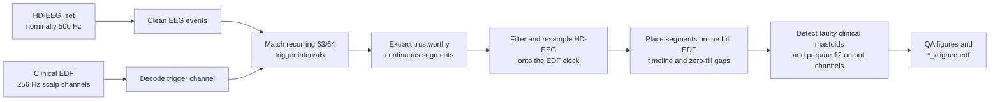

# Stanford Sleep-Lab EEG Alignment

This MATLAB pipeline aligns a Stanford high-density EEG recording with its
clinical sleep-study EDF. The two acquisition systems share an all-night trigger
sequence, but they have independent start times and clocks. The pipeline uses
the shared trigger intervals to identify trustworthy continuous regions, maps
the high-density EEG onto the **clinical EDF clock**, and writes a new EDF in
which 12 direct output channels retain the native clinical voltage grid and the
clinical montage displays the intended aligned high-density derivations.

[`align_recordings.m`](align_recordings.m) is the entry point. It preserves the
clinical EDF and every signal header as the output container. When the clinical
mastoid data are normal, `E1`, `E2`, `M1`, and `M2` retain their recorded content
and the eight scalp rows receive clinical-mastoid-compensated aligned data. When
the clinical mastoids are faulty, all 12 direct output rows are replaced from
aligned HD-EEG sources. Montage-generated EDF rows remain unchanged in both
pathways because the clinical system rebuilds its display montage after import.

## Why alignment is needed

The HD-EEG and clinical systems record the same night independently. Even when
both receive the same triggers, they may begin at different times, accumulate
small clock drift, or lose individual triggers. Matching by recording start time
alone would therefore introduce offsets that grow over the night.

The Stanford trigger schedule provides repeated landmarks. Four consecutive
`64` triggers delimit a recurring cycle; the intervening `63` triggers carry a
distinctive interval pattern. The pipeline compares that pattern between the
two systems, excludes unsafe gaps, and estimates the HD-EEG sampling rate
separately within each continuous matched segment.



## Pipeline at a glance

The ten rows below correspond to the progress checklist printed by
`align_recordings.m`.

| Step | Stage | Main code | Result |
| ---: | --- | --- | --- |
| 1 | Load the EDF trigger channel | `SleepEEG_loadedf` | Trigger trace and trigger-channel sampling rate |
| 2 | Load the HD-EEG recording | `ANT_interface_loadset` | EEGLAB `EEG` structure at 500 Hz |
| 3 | Load the clinical EDF | `SleepEEG_loadedf` | Complete EDF and 256 Hz scalp-channel clock |
| 4 | Extract and match triggers | `extract_triggers`, `match_triggers`, `extract_segments` | Table of trustworthy continuous segments |
| 5 | Truncate HD-EEG channels | `truncate_eeg_segments` | One channels-by-samples array per segment |
| 6 | Resample the segments | `resample_eeg_segments` | Filtered HD-EEG on the exact EDF sample grid |
| 7 | Rebuild the full timeline | `concatenate_eeg_segments` | EDF-length array plus a logical mask of matched samples |
| 8 | Prepare final output channels | `faulty_clinical_detection`, `substitute_eeg_data` | Pathway-specific 12-channel output, bounds report, and trace QA |
| 9 | Run final sanity checks | `sanity_check_spectrogram`, `sanity_check_EOG` | Spectrogram and EOG comparison figures |
| 10 | Write the aligned EDF | `blockEdfWrite` | `<clinical-name>_aligned.edf` |

## Requirements

- MATLAB R2025b, the release used to validate the current test suite. Earlier
  releases have not been tested for this repository.
- Signal Processing Toolbox (`buttord`, `butter`, `zp2sos`, `filtfilt`,
  `kaiserord`, `kaiser`, `pwelch`, and `dpss`).
- Statistics and Machine Learning Toolbox, used by the spectrogram QA scaling
  helper.
- The lab's `sleepeeg_code` repository, which supplies `SleepEEG_loadedf`,
  `blockEdfWrite`, `multitaper_spectrogram_mex` and its compiled backend, and
  `climscale`.
- The lab's `ant_interface_code` repository, which supplies
  `ANT_interface_loadset` and access to EEGLAB.

The current entry point adds these lab repositories from paths under
`~/Dropbox/Active_projects/EEG/code/`. Update those `addpath` calls if your
checkout is elsewhere.

<details>
<summary><strong>Current input and recording assumptions</strong></summary>

The implementation relies on the following Stanford acquisition contract and
fails early for most violations:

- The HD-EEG `.set` file has a sampling rate of exactly 500 Hz.
- The clinical EDF contains a channel labeled exactly `C3`, sampled at exactly
  256 Hz.
- The selected EDF trigger channel is sampled at exactly 128 Hz. The optional
  `trig_channel` argument defaults to `TcPPG`.
- After impedance events, `boundary` events, and `9001`/`9002` amplifier markers
  are excluded, the first remaining HD-EEG events are the validation sequence
  `1, 2, 4, 8, 16, 32, 64`.
- The decoded EDF may contain zero or more `1, 2, 4, 8, 16, 32, 64`
  validation sequences. When more than one is present, the final sequence is
  authoritative for restart alignment. A recording with no EDF validation is
  accepted only through the guarded partial-cycle late-start path described in
  step 4.
- After validation events are removed, alignment triggers are only `63` and
  `64`, and `64` occurs in runs of exactly four.
- The EDF and HD-EEG contain compatible repeated canonical cycles of exactly
  50 triggers.
- The EDF scalp sampling rate is an integer multiple of the EDF trigger-channel
  sampling rate.
- Each required mapped HD-EEG source label in step 5 occurs exactly once. The
  EDF contains exactly one each of `Fp1`, `Fp2`, `F3`, `F4`, `C3`, `C4`, `O1`,
  `O2`, `E1`, `E2`, `M1`, and `M2`. Those 12 direct channels are 256 Hz `uV`
  signals with common valid physical and int16 digital limits. Stored
  `E2:M1`, `E1:M2`, and `E2:M2` rows are not required because the final EOG
  check reconstructs those derivations from the direct rows.

These are current input contracts, with most enforced by executable assertions;
the duplicate-HD-label caveat is noted under current limitations. They are not
general EDF requirements. A recording with different sampling rates,
trigger-value ranges, trigger codes, or channel labels requires a deliberate
code update and corresponding tests.

</details>

## Expected data layout

Run the pipeline from the repository root. `SleepEEG_addpath(matlabroot)`
selects the external subject-data root; beneath that root, the current path
construction expects:

```text
<data root returned by SleepEEG_addpath>/
└── <subject_code>/
    ├── set/
    │   └── <subject_code>_sleep_ds500_Z3.set
    └── clinical/
        └── <subject_code>.edf
```

On the current macOS configuration, that data root is
`~/Dropbox/Active_projects/EEG/data`. Subject recordings are external to this
repository and should not be copied into the checkout.

## Running the pipeline

1. Confirm that the external lab-code paths near the top of
   [`align_recordings.m`](align_recordings.m) match your checkout.
2. Confirm that the paired files follow the subject layout above.
3. In MATLAB, change into the repository root and pass the subject code as a
   row character vector. The optional trigger channel must use the same text
   type:

```matlab
cd('/path/to/sleeplab_trigger_alignment')
align_recordings('sas_001')                  % defaults to TcPPG

% Or keep the figures open for interactive review:
figure_cleanup = align_recordings('sas_001', 'TcPPG');
% ...review figures...
clear figure_cleanup
```

The function prints a ten-step progress checklist, writes a timestamped log,
saves diagnostic PNGs in the subject's `clinical` directory, and writes the
aligned EDF there. With no captured output, the figures close before the
function returns. Capturing `figure_cleanup` keeps them open until that value is
cleared.

## Pipeline, step by step

### 1. Load the EDF trigger channel

The pipeline first loads only the selected trigger channel from the clinical
EDF. This is the low-memory pass used to recover the trigger waveform and its
sampling rate.

<details>
<summary><strong>Technical details</strong></summary>

`SleepEEG_loadedf(fn_edf, {trig_channel})` returns the EDF header, the selected
signal header, and its samples. The trigger sampling rate is derived from EDF
metadata rather than hard-coded:

```matlab
trigger_Fs = signalHeader.samples_in_record ./ header.data_record_duration;
```

The selected trace is later stored as `edf_input.DC_trace`; its sample indices
remain on the **EDF trigger-channel clock**, which can differ from the EDF scalp
clock.

</details>

### 2. Load the HD-EEG recording

The Stanford HD-EEG `.set` file is loaded into an EEGLAB `EEG` structure. Its
events provide one side of the shared trigger sequence, while `EEG.data`
provides the channels that will ultimately be aligned.

<details>
<summary><strong>Technical details</strong></summary>

The path is split with `fileparts`, then loaded with
`ANT_interface_loadset(filename, filepath, false)`. That wrapper starts EEGLAB
without its GUI and calls `pop_loadset`. The pipeline reads `EEG.srate` and
asserts that it is exactly 500 Hz.

The HD-EEG clock is not assumed to remain exactly 500 Hz during alignment. The
nominal rate is used for trigger times and input validation; a segment-specific
effective rate is derived later from matched EDF anchors.

</details>

### 3. Load the complete clinical EDF

The pipeline then loads every clinical EDF channel. The original EDF supplies
the authoritative output duration, channel headers, non-EEG signals, and the
256 Hz scalp-channel sample grid.

<details>
<summary><strong>Technical details</strong></summary>

The scalp sampling rate is derived from the exact `C3` label:

```matlab
c3_index = strcmp({signalHeader_all.signal_labels}, 'C3');
edf_Fs = signalHeader_all(c3_index).samples_in_record ...
    / header_all.data_record_duration;
```

The implementation asserts `edf_Fs == 256`. The number of samples in this C3
signal later defines the total length of the aligned EEG matrix. The
[`sanity_plot_EDF_data.m`](helper_functions/sanity_plot_EDF_data.m) helper then
plots the native clinical C3 and trigger signals on their own sampling grids.

</details>

### 4. Extract triggers, match cycles, and define continuous segments

Both recordings are reduced to cleaned trigger tables. The pipeline learns the
recurring nightly interval pattern, matches corresponding chunks across the two
systems, and converts only trustworthy runs of paired intervals into continuous
segments. Unsafe gaps split segments rather than being interpolated across.

<details>
<summary><strong>Technical details: trigger extraction</strong></summary>

[`extract_triggers.m`](helper_functions/extract_triggers.m) performs different
cleanup for each acquisition system.

For HD-EEG events it:

- normalizes event types to stripped strings;
- removes impedance events and EEGLAB `boundary` events;
- verifies and removes the initial `1, 2, 4, 8, 16, 32, 64` validation sequence;
- removes amplifier disconnect/reconnect codes `9001` and `9002` from the
  canonical trigger stream while retaining their raw text, original event
  indices and latencies, and surrounding trigger anchors in an interruption
  table; marker order is validated, with a trailing disconnect recorded as
  `missing_reconnect`;
- requires all remaining events to be `63` or `64`; and
- requires each retained run of `64` events to contain exactly four triggers.

For the EDF trigger waveform it finds contiguous samples above the numeric
threshold `1` and maps each chunk's maximum loaded value to a trigger code. The
thresholds are interpreted in the channel's physical units as returned by the
EDF loader:

| Trigger code | Accepted peak range |
| ---: | ---: |
| `1` | 5–6 |
| `2` | 11–12.1 |
| `4` | 18–19 |
| `8` | 24–25 |
| `16` | 30–31 |
| `63` | 36–37 |
| `64` | 42–43 |

Stable 63-to-64 transitions that arrived as one above-threshold chunk are split
before classification when both value-range runs contain at least three samples.
The extractor also resolves the validation sequence's ambiguous sixth pulse as
`32`, removes unmapped orphan chunks, records and removes every validation
occurrence, and discards malformed `64` runs. Zero EDF validation sequences are
permitted; when sequences are present, metadata identifies the final one as the
authoritative validation boundary.

Trigger times in both systems use MATLAB's one-based sample convention:

```text
time_seconds = (latency - 1) / sampling_rate
```

Because the entry point passes `true`, a three-panel comparison of HD-EEG,
clinical EDF, and overlaid inter-trigger intervals is plotted.

</details>

<details>
<summary><strong>Technical details: trigger matching</strong></summary>

[`match_triggers.m`](helper_functions/match_triggers.m) calls
[`extract_canonical_cycle.m`](helper_functions/extract_canonical_cycle.m) for
each system. Runs of four `64` events define candidate cycle boundaries. Among
bounded chunks, the most frequently repeated trigger-type and interval
structure becomes the canonical cycle. At least three intact boundaries must be
present, the selected structure must repeat at least twice, and ties between
distinct structures are rejected. HD-EEG must begin at an intact boundary; EDF
may instead contain a guarded leading partial cycle.

The EEG and EDF canonical cycles must each contain exactly 50 triggers with the
same types and interval timing within a shared tolerance:

```matlab
interval_tolerance_sec = 2 / min([eeg_Fs, edf_trigger_Fs]);
```

The matcher advances through EEG and EDF chunks independently. It explicitly
records canonical matches, short loss in either system, a shared trigger glitch,
a suspected missing cycle boundary, divergent noncanonical chunks, leading EDF
data before a trigger-box restart, and the terminal relationship between the
recordings. Supported gaps are bracketed by trustworthy trigger anchors;
ambiguous loss that cannot be resolved safely stops or requires re-locking.

For a true EDF late start without a validation sequence, the leading events must
be only `63` triggers and provide at least two consecutive intervals that match
one unique suffix of both the EDF canonical cycle and HD-EEG cycle 1. The first
matched `63` source pair becomes the initial anchor. Ambiguous phase, insufficient
evidence, or disagreement fails explicitly. When a final EDF validation sequence
follows earlier regular triggers, those earlier events are marked pre-alignment,
the first complete post-validation cycle must match HD-EEG cycle 1, and its first
regular `64` becomes the restart anchor.

Each paired `9001`/`9002` amplifier interruption is audited against EDF timing.
A single affected interval is retained only when it remains within tolerance;
supported mismatched or multi-interval brackets are excluded only when their
anchors map safely and a post-reconnect interval confirms re-locking. Ambiguous
or inconsistent evidence requires manual review or fails explicitly rather than
being resolved by guessing an offset. A final disconnect without a reconnect is
treated as terminal EEG loss when its pre-disconnect anchor maps safely to EDF,
ending the trusted segment at that anchor.

With plotting enabled, the matcher shows the original HD-EEG trigger timeline,
the HD-EEG timeline shifted to the initial EDF anchor, and the EDF timeline.
Unsafe intervals and terminal padding/truncation are marked on the plot.

</details>

<details>
<summary><strong>Technical details: continuous-segment extraction and drift checks</strong></summary>

[`extract_segments.m`](helper_functions/extract_segments.m) reconstructs the
matched trigger intervals from the matcher's comparison history. Consecutive
paired intervals become one segment; discontinuities in either system begin a
new segment. Intervals flagged as unsafe by amplifier-interruption handling are
excluded even if their trigger timing otherwise matches. The resulting table
includes inclusive EEG and EDF start/end samples, durations, source
chunk/interval identifiers, and clock-drift metrics.

For every segment, cumulative

```text
EDF elapsed time - HD-EEG elapsed time
```

is fit as a linear function of HD-EEG elapsed time. The maximum detrended
residual must remain within the trigger-matching tolerance. This guards the
later constant-rate resampling step against nonlinear clock behavior inside a
segment. The table is printed, and the current entry point also plots the drift
series because it passes `true`.

</details>

### 5. Truncate and order the HD-EEG channels

For each matched segment, the required Stanford channels are selected from the
full HD-EEG recording in a fixed clinical order. The auxiliary vertical EOG
channel follows the same alignment path for QA but is not substituted into the
EDF.

<details>
<summary><strong>Technical details: channel mapping</strong></summary>

[`truncate_eeg_segments.m`](helper_functions/truncate_eeg_segments.m) uses the
following exact label mapping:

| Aligned label | Stanford HD-EEG label | Role |
| --- | --- | --- |
| `Fp1` | `L1` | EDF EEG |
| `Fp2` | `R1` | EDF EEG; also faulty-path `E2` source |
| `F3` | `LL2` | EDF EEG |
| `F4` | `RR2` | EDF EEG |
| `C3` | `LA2` | EDF EEG |
| `C4` | `RA2` | EDF EEG |
| `O1` | `LL11` | EDF EEG |
| `O2` | `RR11` | EDF EEG |
| `M1` | `LD6` | HD reference and faulty-path `M1` source |
| `M2` | `RD6` | HD reference and faulty-path `M2` source |
| `VEOGL` | `VEOGL` | EOG QA and faulty-path `E1` source |

The helper returns one cell per matched segment, with channels in rows and the
inclusive range `eeg_start_sample:eeg_end_sample` in columns. Missing mapped
labels cause an error rather than a positional fallback.
The entry point defines `aligned_eeg_channel_names` once and passes it
explicitly to truncation, resampling, and concatenation rather than storing the
list as an ad hoc field in `eeg_input` or `edf_input`.

</details>

### 6. Filter and resample each segment onto the EDF clock

Each continuous HD-EEG segment is mean-centered, high-pass filtered, protected
against aliasing, and evaluated directly on the exact 256 Hz EDF sample grid.
The EDF duration between matched trigger anchors—not the nominal 500 Hz clock—
determines the resampling ratio.

<details>
<summary><strong>Technical details: timing and exact output length</strong></summary>

For each segment, the effective HD-EEG rate is

```text
edf_duration_sec   = (edf_end - edf_start) / edf_trigger_Fs
effective_eeg_Fs   = (eeg_end - eeg_start) / edf_duration_sec
target_sample_span = (edf_end - edf_start) * (edf_Fs / edf_trigger_Fs)
output_count       = round(target_sample_span) + 1
```

The `+1` preserves both inclusive anchor samples. Zero-based output position
`k = 0, ..., target_sample_span` maps to

```text
k * eeg_sample_span / target_sample_span
```

on the input segment, so the first and last samples land exactly on their
matched EDF anchors. The helper asserts the target span is integral and verifies
the output length for every segment.

</details>

<details>
<summary><strong>Technical details: filtering and interpolation</strong></summary>

[`resample_eeg_segments.m`](helper_functions/resample_eeg_segments.m) applies
the following operations to every channel:

1. Convert to double precision.
2. Subtract the channel mean.
3. Apply a zero-phase Butterworth high-pass using second-order sections and
   `filtfilt`: 80 dB final attenuation at 0.15 Hz and no more than 0.05 dB final
   loss at the 0.30 Hz passband edge.
4. Evaluate a Kaiser-windowed sinc kernel on the EDF grid. The same kernel
   combines fractional-delay interpolation with an 80 dB anti-aliasing design
   whose passband ends at 120 Hz and stopband begins at the 128 Hz EDF Nyquist
   frequency.

The sinc calculation is blockwise to avoid creating an hours-long dense weight
matrix, and it reflects sample indices at segment boundaries. Near 500 Hz, the
anti-aliasing design produces a 315-tap symmetric kernel. Very-low-frequency
high-pass transients can extend roughly 50–60 seconds from a segment edge, which
is important when interpreting short segments.

During this stage, the entry point reports each channel's high-pass filtering
and approximately 10% progress milestones for the exact-grid resampling of each
segment.

Because the entry point enables sanity plots, each segment also produces a
5-by-2 trace comparison for the eight scalp and two HD mastoid source
channels: the mean-centered, high-pass, anti-alias-filtered signal on the input
grid versus the resampled signal on the EDF output grid. A second figure shows
a Welch spectrum of the resampled signals. `VEOGL` is excluded from these
plots.

</details>

### 7. Concatenate segments and zero-fill the EDF timeline

The resampled segments are placed at their matching positions on an array with
the exact length of the original EDF C3 channel. Samples before the first
segment, between segments, and after the last segment remain zero.

<details>
<summary><strong>Technical details</strong></summary>

Matched EDF bounds are still expressed on the trigger-channel clock. With

```text
ratio = edf_Fs / edf_trigger_Fs
```

[`concatenate_eeg_segments.m`](helper_functions/concatenate_eeg_segments.m)
converts either inclusive one-based bound as

```text
scalp_sample = (trigger_sample - 1) * ratio + 1
```

The helper requires an integer ratio, chronological non-overlapping segments,
in-range bounds, and an exact agreement between each resampled segment's length
and its converted EDF bounds. It preallocates zeros, so unmatched or unsafe
regions are explicit in every aligned channel, including `VEOGL`. Its second
output is a logical vector marking the same inclusive placement ranges. That
single mask defines the samples used by both fault detection and bounds QA.

</details>

### 8. Detect faulty clinical mastoids and prepare final output channels

The clinical system imports direct electrode values and applies its display
montage afterward. All 12 direct rows therefore retain their original EDF
headers and native shared calibration; no channel is requantized or rescaled.
The data written into those rows depend on the clinical mastoid status.
Exported montage-generated rows and all other EDF signals remain exactly as
loaded.

<details>
<summary><strong>Technical details: detection, substitution, and bounds QA</strong></summary>

[`faulty_clinical_detection.m`](helper_functions/faulty_clinical_detection.m)
examines direct `M1` and `M2` only within the logical matched-sample mask. For
each mastoid it calculates the proportion satisfying `abs(signal) >= 1000 uV`,
then marks the clinical system faulty only when the unrounded mean of those two
proportions is greater than 2%. Its plain-text log report includes matched and
total sample counts, coverage, both channel percentages, their mean, and a
`NORMAL` or `FAULTY` status. Missing, duplicate, wrong-rate, wrong-unit,
wrong-length, `NaN`, or `Inf` inputs fail explicitly.

[`substitute_eeg_data.m`](helper_functions/substitute_eeg_data.m) uses the
following exact output derivations. The loaded collection remains
`signalCell_all`; the substituted collection is returned as `signalCell_final`
and is used for output-channel QA and EDF writing. The original
`signalCell_all` remains available for the clinical EOG alignment check.

| EDF channel | Normal clinical pathway | Faulty clinical pathway |
| --- | --- | --- |
| `Fp1` | aligned `Fp1 - M2` + clinical `M2` | aligned `Fp1` |
| `Fp2` | aligned `Fp2 - M1` + clinical `M1` | aligned `Fp2` |
| `F3` | aligned `F3 - M2` + clinical `M2` | aligned `F3` |
| `F4` | aligned `F4 - M1` + clinical `M1` | aligned `F4` |
| `C3` | aligned `C3 - M2` + clinical `M2` | aligned `C3` |
| `C4` | aligned `C4 - M1` + clinical `M1` | aligned `C4` |
| `O1` | aligned `O1 - M2` + clinical `M2` | aligned `O1` |
| `O2` | aligned `O2 - M1` + clinical `M1` | aligned `O2` |
| `M1` | clinical `M1` | aligned `M1` (`LD6`) |
| `M2` | clinical `M2` | aligned `M2` (`RD6`) |
| `E1` | clinical `E1` | aligned `VEOGL` |
| `E2` | clinical `E2` | aligned `Fp2` (HD source `R1`) |

Thus, in the normal pathway, a clinical montage such as `C3:M2` displays

```text
(aligned C3 - aligned M2 + clinical M2) - clinical M2
    = aligned C3 - aligned M2
```

In the faulty pathway, the clinical montage subtracts the replaced HD mastoid
directly from the aligned active electrode. Because the same already-processed
`R1` row serves both `Fp2` and `E2`, it is not filtered or resampled twice.

Before substitution, the helper validates that all 12 direct labels occur
exactly once, are `uV` channels with a common samples-per-record value, and
share valid physical and int16 digital limits. It does not modify those limits.
After substitution, it prints a 12-row table in the fixed order `Fp1`, `Fp2`,
`F3`, `F4`, `C3`, `C4`, `O1`, `O2`, `M1`, `M2`, `E1`, `E2`. The table records
each channel's pathway-specific output derivation, shared physical limits, and
the percentage strictly outside those limits within matched samples only.
Exact boundary values are allowed; decisions use unrounded percentages even
though the table displays three decimals.

The step-8 figure still plots every output sample in all 12 rows, with dotted
native physical bounds and y-limits extending 500 uV beyond them. If any raw
matched-sample percentage exceeds 1%, the helper prints the table and then
fails before creating the figure or writing an aligned EDF.

</details>

### 9. Run final sanity checks

Two additional views compare the aligned output with signals that remain in
their native recording context: a C3:M2 spectrogram comparison and a
four-trace EOG comparison. These are intended for human review before the
aligned EDF is used downstream.

<details>
<summary><strong>Technical details: QA figures</strong></summary>

[`sanity_check_spectrogram.m`](helper_functions/sanity_check_spectrogram.m)
compares:

- native HD-EEG `C3:M2`, calculated as `LA2 - RD6` after mean-centering and the
  same high-pass filter, at the original 500 Hz; and
- the clinical-montage result reconstructed as final EDF `C3 - M2`, which
  recovers the resampled, zero-padded HD-EEG `C3:M2` at the EDF rate under
  either clinical pathway.

Both use multitaper spectrograms over 0–40 Hz with shared color limits. Before
each call, the requested 0.05-second step is rounded upward to a whole number
of samples at that signal's sampling rate.

[`sanity_check_EOG.m`](helper_functions/sanity_check_EOG.m) compares aligned
`VEOGL:M2` (`VEOGL - RD6`) with `E2:M1`, `E1:M2`, and `E2:M2` reconstructed
from the original clinical EDF `E1`, `E2`, `M1`, and `M2` rows in
`signalCell_all` on a shared EDF time axis. Stored montage rows are ignored, so
the figure always compares the aligned HD-EEG signal against direct clinical
recordings rather than pathway-specific substituted output.

With plotting enabled throughout the current entry point, it opens:

- inter-trigger interval comparisons;
- the native clinical EDF C3 and trigger channels;
- the original/aligned/EDF trigger timeline;
- a clock-drift plot with one trace per segment;
- per-segment time-trace and Welch-spectrum resampling checks;
- all 12 final output EDF rows with native writer bounds;
- native-versus-aligned C3:M2 spectrograms; and
- aligned-versus-clinical EOG traces.

These figures are saved automatically as step-numbered alignment-check PNGs in
the subject's `clinical` directory. Figures within the same step include an
execution-order index so alphabetical sorting preserves their intended order;
per-segment resampling filenames also include a zero-padded segment number.
The [`save_and_track_alignment_figure.m`](helper_functions/save_and_track_alignment_figure.m)
helper registers cleanup for the explicit returned figure handles before
exporting them. Clearing a captured
`figure_cleanup` therefore closes only those figures, and an export failure
still closes the tracked set without affecting unrelated figures. The current
filename tails after the common `<subject_code>_alignment_check_` prefix
are `step3_clinical_c3_trigger`, `step4_1_trigger_intervals`,
`step4_2_trigger_alignment`, `step4_3_clock_drift`, `step6_segNN_1_trace`,
`step6_segNN_2_spectrum`, `step8_scalp_substitution`, `step9_1_spectrogram`, and
`step9_2_eog`, each followed by `.png`.

</details>

### 10. Write the aligned EDF

Finally, the complete EDF header and signal collection are written beside the
source recording with `_aligned` inserted before the `.edf` extension.

<details>
<summary><strong>Technical details</strong></summary>

The output name is currently constructed with:

```matlab
edfFN = strrep(fn_edf, '.edf', '_aligned.edf');
blockEdfWrite(edfFN, header_all, signalHeader_all, signalCell_final);
```

When its output is captured, `align_recordings` returns cleanup guards that keep
the QA figures open until that output is cleared. With no captured output, its
figures close before the function returns. Its durable outputs are the aligned
EDF, `<subject_code>_alignment_YYYYMMDD_HHMMSS.log`, and step-numbered
alignment-check PNGs. If the aligned EDF already exists, the writer writes over
it in place. PNG names do not include the log's run timestamp, so archive or
remove the earlier `<subject_code>_alignment_check_*.png` set before rerunning;
otherwise plots for segments not produced by the new run can remain beside the
new files.

</details>

## Interpreting the output

- **Time is EDF time.** The output length and sample positions follow the
  clinical 256 Hz scalp clock.
- **Zero-filled working data outside matched segment bounds mean no trusted
  aligned HD-EEG is available.** In the normal pathway, a prepared scalp row
  equals its original clinical mastoid in these regions, so the clinical
  montage subtraction displays zero. In the faulty pathway, all 12 replacement
  sources are zero there. Individual samples inside a valid, mean-centered
  segment can also naturally equal zero.
- **The 12 direct montage headers remain unchanged.** Eight scalp rows are
  always replaced. Clinical `E1`, `E2`, `M1`, and `M2` remain original only in
  the normal pathway and are replaced from aligned HD-EEG sources in the faulty
  pathway. Montage-generated rows, other clinical channels, and unrelated
  metadata are carried through unchanged.
- **Plots are part of the review.** A completed checklist means the code ran to
  the writer; it does not replace visual inspection for incorrect channel
  polarity, clipping, unexpected gaps, or physiologically implausible alignment.

## Current limitations

- Both text inputs must currently be MATLAB row character vectors, as in
  `align_recordings('sas_001', 'TcPPG')`. A string-scalar `subject_code` is not
  normalized before filename construction, and a string-scalar `trig_channel`
  fails the external loader's cell-string check. The `.set` and clinical EDF
  basenames are fixed from the subject code. Plotting and the external lab-code
  paths remain hard-coded.
- The top-level function does not stop solely because the matcher reports that
  nonterminal data require re-locking; it can write the earlier trustworthy
  segments and leave later aligned montage derivations at zero, using the
  pathway-specific direct rows described above.
  Review the alignment plot and segment table. A terminal region without a
  preceding lock, or with disagreeing trigger correspondence, fails explicitly;
  supported shorter/longer terminal cases still anchor and pad or truncate.
- HD-EEG and EDF replacement channels are assumed to use compatible physical
  units. No unit conversion is performed. The 12 direct montage channels retain
  their native shared physical and digital limits. The helper reports all 12
  channels against those bounds using matched samples only, and the entry point
  stops before writing if any channel exceeds 1% outside the bounds.
- Other signal-header fields, including transducer and prefilter descriptions,
  also remain those of the original clinical channels and may not describe the
  substituted HD-EEG source.
- HD-EEG channel lookup does not currently reject duplicate source labels. Each
  mapped Stanford label must therefore occur exactly once in `EEG.chanlocs`.
- The aligned EDF is written directly to its final path. The external writer
  does not compare its `fwrite` counts with the expected counts, and the entry
  point does not request or check writer status before reporting completion.
  Preserve any prior aligned output and verify the new file in the intended
  viewer.
- The function does not return or serialize the match-result structure or
  segment table as MATLAB data. Their printed diagnostics are captured in the
  timestamped alignment log; the only MATLAB return is the figure-cleanup cell.
- Tests exercise the helpers with synthetic fixtures, but there is no automated
  end-to-end test of `align_recordings.m` on a complete paired recording.

## Tests

The unit tests use primarily synthetic fixtures and cover canonical-cycle
inference, guarded EDF partial-cycle starts, final-validation restarts,
`9001`/`9002` amplifier interruptions, trigger loss, terminal alignment, segment
construction and linear-drift validation, exact EDF-grid resampling, filter
response, zero padding and matched-sample masks, faulty-clinical detection,
both channel-substitution pathways, QA plots, and PNG export naming.

One matcher regression uses the tracked, trigger-event-only fixture
`tests/sas_023_trigger_event_tables.mat`. Raw subject recordings and subject
directories are not required to run the suite.

From the repository root:

```matlab
results = runtests('tests');
assertSuccess(results)
```

For a noninteractive shell run when `matlab` is on `PATH`:

```bash
matlab -batch "results = runtests('tests'); assertSuccess(results)"
```

The automated suite does not replace an end-to-end run on a real paired
HD-EEG/EDF recording. In particular, verify the generated figures and inspect
the resulting EDF in the intended clinical viewer before downstream use.

## Repository structure

```text
align_recordings.m       Main ten-stage orchestration entry point
helper_functions/        Trigger, segment, resampling, detection, substitution, and QA helpers
tests/                   MATLAB unit tests with primarily synthetic fixtures
```

The code deliberately keeps each processing stage in a named helper so that
clock assumptions, channel contracts, and failure cases can be tested in
isolation.
